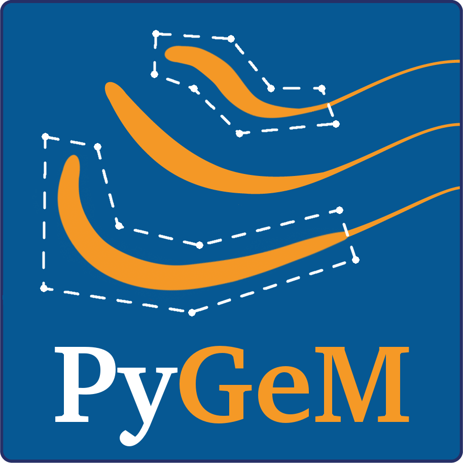

Welcome to PyGeM's documentation!
===================================================

Python utilities for geometrical morphing.

Description
^^^^^^^^^^^^

PyGeM is a python library using Free Form Deformation, Radial Basis Functions and Inverse Distance Weighting to parametrize and morph complex geometries.  It is ideally suited for actual industrial problems, since it allows to handle:

- Computer Aided Design files (in .iges, .step, and .stl formats)
- Mesh files (in .unv, Elmer, and OpenFOAM formats)
- Output files (in .vtk format)
- LS-Dyna Keyword files (.k format)

By now, it has been used with meshes with up to 14 milions of cells. Try with more and more complicated input files!
See the Tutorials section below to have an idea of the potential of this package.

Installation
^^^^^^^^^^^^
The code has been tested with Python3.7 version, but it should be compatible with a generic Python3.x. The Python2 support is no longer maintained.

To install the pygem package, open the terminal/command line and clone the repository with the command
::

	 git clone https://github.com/mathLab/PyGeM

For a complete list of dependencies to be installed via conda please refer to the official `repository <https://github.com/mathLab/PyGeM>`_.
After installing the dependencies you can navigate into the ``PyGeM`` folder (where the ``setup.py`` file is located) and run the command
::

	 python setup.py install

You should now be able to import the pygem library in Python scripts and interpreters with the command ``import pygem``.

Alternatively, there is the possibility to get PyGeM through prebuilt and high-performance Docker images. Please, for the details, refer to the official `repository <https://github.com/mathLab/PyGeM>`_.

Developer's Guide
^^^^^^^^^^^^^^^^^^^^^^^

.. toctree::
   :maxdepth: 1

   code
   tutorials
   contact
   contributing
   LICENSE
