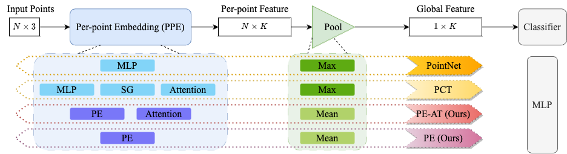

# Robust Point Cloud Processing through Positional Embedding 
### [Project Page](https://osiriszjq.github.io/RobustPPE) | [Paper](https://arxiv.org/pdf/2309.00339.pdf)
[](https://opensource.org/licenses/MIT)


[Jianqiao Zheng](https://github.com/osiriszjq/),
[Xueqian Li](https://lilac-lee.github.io/),
[Sameera Ramasinghe](https://scholar.google.pl/citations?user=-j0m9aMAAAAJ&hl=en),
[Simon Lucey](https://www.adelaide.edu.au/directory/simon.lucey)<br>
The University of Adelaide


This is the official implementation of the paper "Robust Point Cloud Processing through Positional Embedding". This codebase is based on [Benchmarking Robustness of 3D Point Cloud Recognition against Common Corruptions](https://github.com/jiachens/ModelNet40-C) by Jiachen Sun et al., and we thank the authors for their great contributions.


#### Illustration of different methods to extend 1D encoding



## Getting Started

#### Install Libraries
The environment is same as [Benchmarking Robustness of 3D Point Cloud Recognition against Common Corruptions](https://github.com/jiachens/ModelNet40-C). The core steps are listed below.
```
conda create --name modelnetc python=3.7.5
conda activate modelnetc
pip install -r requirements.txt
conda install sed  # for downloading data and pretrained models
./setup.sh
```

#### Datasets
You can download ModelNet40 and ModelNet40-C from [Benchmarking Robustness of 3D Point Cloud Recognition against Common Corruptions](https://github.com/jiachens/ModelNet40-C).
You can download our modified ModelNet40-C from [Google Drive](https://drive.google.com/drive/folders/106mMblD3HP93vhauG4PMirx01WP2j24y?usp=sharing) and put them under `data/`.

 
## Running Experiments

#### Training and Config files
To train any model, use command in the following format. 
```
python main.py --exp-config <path to the config>
```
The train command we use is in `train.sh`. We only use dataset from DGCNN with simple augmetation (wihch is usually considered as "unaugmented").


#### Corruption test
To test a pretrained model with different corruptions, use command in the following format.

```
python main.py --entry test --model-path <cor_exp/runs>/<cfg_name>/<model_name>.pth --exp-config configs/corruptions/<cfg_name>.yaml
```

The evaluation commands we use are in the `eval_cor_modelnet40c.sh`, `eval_cor_modelnet40c_our.sh` scripts.

## Citation
```
@misc{zheng2023robust,
      title={Robust Point Cloud Processing through Positional Embedding}, 
      author={Jianqiao Zheng and Xueqian Li and Sameera Ramasinghe and Simon Lucey},
      year={2023},
      eprint={2309.00339},
      archivePrefix={arXiv},
      primaryClass={cs.CV}
}
```
